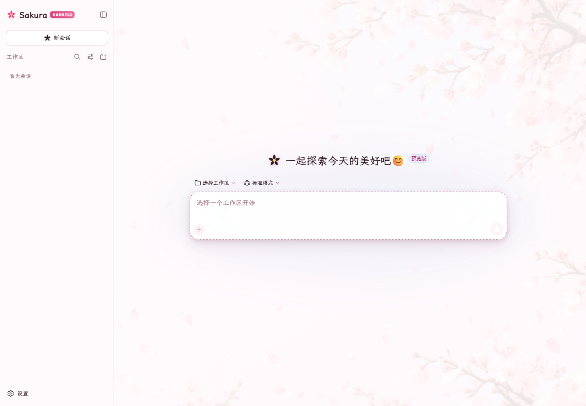
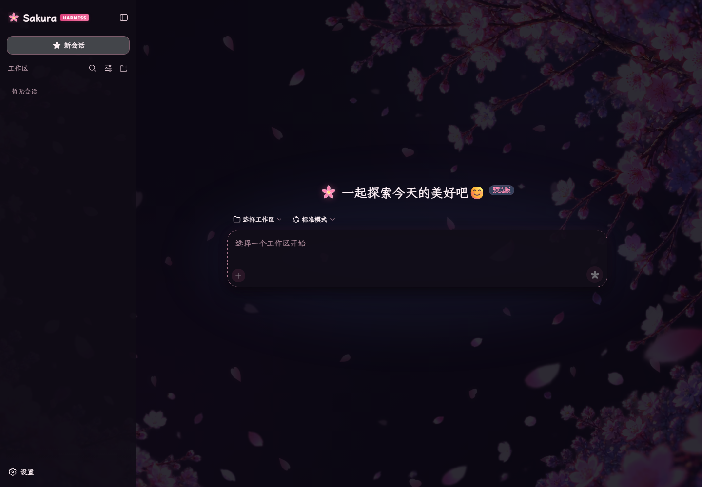

# Sakura Harness Theme

[English](./README.en.md) | 中文

**让 DeepSeek Harness 在保持专业与可读性的同时，多一点樱花盛开的生命力。**

Sakura Harness Theme 是一款完整、可逆的 DeepSeek Harness Web 樱花主题。一次安装即可获得浅色“晴樱”与深色“夜樱”，并自动跟随 Harness 的 Light / Dark / System 偏好。它不只替换背景，还统一重塑品牌、色彩、字体、图标、卡片与交互状态，同时保持原有功能行为不变。

> 本项目是社区维护的非官方插件，与 DeepSeek 官方没有隶属关系。

## 实际使用效果

以下截图来自插件在 DeepSeek Harness Web 中的真实运行界面。点击图片可查看原图。

| 晴樱 · Light | 夜樱 · Dark |
| --- | --- |
| [](./docs/screenshots/sakura-theme-light.png) | [](./docs/screenshots/sakura-theme-dark.png) |

## 为什么值得安装

| 你得到的 | 实际价值 |
| --- | --- |
| 一套插件，两套完整主题 | 白天使用清透柔和的“晴樱”，夜间切换沉浸克制的“夜樱”，无需分别配置。 |
| 从背景到控件的系统化设计 | 侧栏、输入区、菜单、代码块、滚动条和弹窗共享统一视觉语言，不是简单贴一张壁纸。 |
| 独立的 Sakura Harness 品牌 | 原创樱花标志、字标、发送图标和新会话图标，让工作台拥有清晰、完整的个性。 |
| 更适合中文长对话的阅读体验 | 内置霞鹜文楷屏幕阅读版 GB，正文温润清晰，代码区域仍保持等宽字体。 |
| 可逆且尊重功能语义 | 不改变提交、导航或模型交互；停止、警告、文件等关键图标保持原义，卸载后恢复宿主外观。 |

## 快速安装

```powershell
dsh plugin --profile web add dsh-sakura-theme
```

完整重启 `dsh web` 后即可使用。之后只需在外观设置中选择 Light、Dark 或 System，插件会自动切换晴樱与夜樱。

## 兼容性

- DeepSeek Harness Web `0.1.1-rc.2` 系列。
- Node.js `20` 或更高版本。

## 设计与功能细节

- 覆盖主要背景、文字、边框、按钮、侧栏、输入框、菜单、代码块和滚动条 Token。
- 左侧与新会话首页使用原创 Sakura Harness 樱花标志和字标。
- 发送按钮使用樱花图标，新会话按钮使用“花开 +”图标；停止、警告、文件等功能图标保留原语义。
- 内置霞鹜文楷屏幕阅读版 GB 字体，离线也能保持可爱、清晰的中文显示；代码仍使用等宽字体。
- 活动区域使用半透明白色或黑色表面，背景樱花只从边缘透出。
- 重新设计三级语义阴影，让输入卡片、确认弹窗、菜单、浮动按钮等框体在浅色与深色模式下都保持清晰层次。
- 新会话首页标题显示为“一起探索今天的美好吧😊”。
- 成功、警告、危险继续使用绿、琥珀和红，不与主题粉色混淆。
- 原创浅色与深色透明樱花边框。
- 矢量花瓣层沿右上到左下缓慢飘动。
- 遵循 `prefers-reduced-motion`，卸载插件后自动移除 Token 覆盖与样式。

## 构建

```powershell
node scripts/build.mjs
node scripts/check.mjs
```

## 安装

### 从 npm 安装（推荐）

可直接安装预构建包，不需要授权执行依赖构建脚本：

```powershell
dsh plugin --profile web add dsh-sakura-theme
```

### 从 GitHub Release 安装

使用 GitHub CLI 下载当前 Release 安装包：

```powershell
gh release download v0.3.0 --repo a1303845406/dsh-sakura-theme --pattern "dsh-sakura-theme-0.3.0.tgz"
dsh plugin --profile web add .\dsh-sakura-theme-0.3.0.tgz
```

### 从 GitHub 源码构建安装

源码仓库不提交构建产物，因此克隆后需要先构建：

```powershell
git clone https://github.com/a1303845406/dsh-sakura-theme.git
Set-Location .\dsh-sakura-theme
npm run build
npm run check
dsh plugin --profile web add .
```

完整重启 `dsh web` 后生效。外观设置继续选择 Light、Dark 或 System；插件会自动切换晴樱与夜樱。

> 品牌替换需要停用内置 `ui-brand-official` occupant，因此更新插件后必须完整重启一次，单纯刷新页面不够。

## 第三方字体

本插件内置未经修改字形的 LXGW WenKai GB Screen v1.522，并转换为 WOFF 供浏览器渲染。字体依据 SIL Open Font License 1.1 分发，完整许可见 `assets/OFL-LXGW-WenKai.txt`。

## 卸载

```powershell
dsh plugin --profile web remove dsh-sakura-theme
```

## 开源许可

本项目代码使用 [MIT License](LICENSE)；内置字体依据 SIL Open Font License 1.1 分发。
